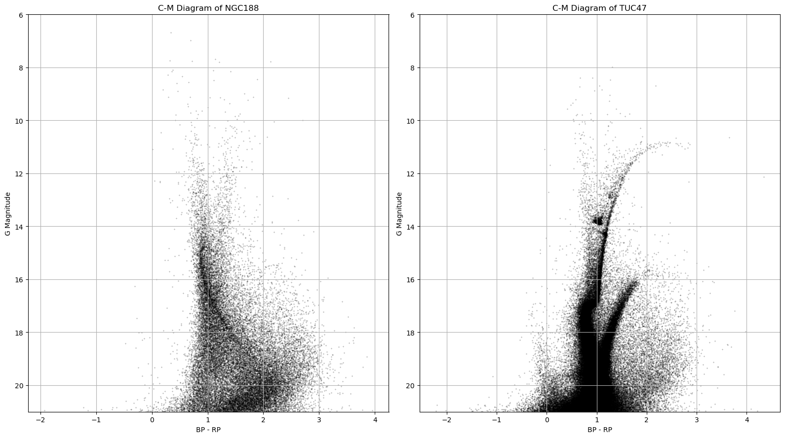
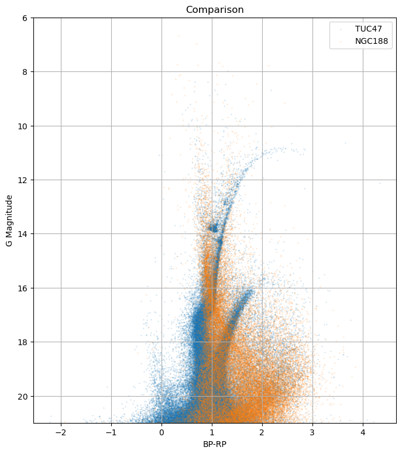

# 천문학 데이터 시각화 및 분석 프로젝트

이 프로젝트는 공개된 천문학 데이터를 이용해 H-R 다이어그램을 시각화하고, 구상성단과 산개성단의 H-R diagram 차이를 비교하며, 혜성의 궤도 데이터를 분석합니다. 모든 분석은 Python과 Jupyter Notebook을 사용하여 수행되었습니다.

---

## 이론적 배경

### 1. HR Diagram

HR 다이어그램(Hertzsprung–Russell diagram)은 별의 절대등급 또는 광도와 온도(또는 색지수) 사이의 관계를 나타내는 산점도입니다. 별의 진화 단계(main sequence, red giant, white dwarf 등)를 시각적으로 이해할 수 있습니다.

### 2. 산개성단과 구상성단

- **산개성단(Open Cluster)**: 은하 평면에 분포하는 나이가 어린 성단으로, 별들이 흩어져 있는 모양입니다.
- **구상성단(Globular Cluster)**: 은하 헤일로에 분포하는 나이가 많은 성단으로, 구형 구조를 가집니다. 

### 3. 혜성 데이터 분석

혜성의 궤도 요소(e.g. eccentricity, inclination 등)를 통해 태양계를 공전하는 혜성들의 특징을 분석할 수 있습니다. KMeans 클러스터링을 통해 혜성군 분류도 시도했습니다.

---

## 데이터 설명

| 파일명 | 설명 |
|--------|------|
| `hipparcos-voidmain.csv` | Hipparcos 데이터 기반 항성 목록 |
| `ngc188_data.csv` | 산개성단 NGC 188의 별 데이터 |
| `tuc47_data.csv` | 구상성단 47 Tuc의 별 데이터 |
| `CometEls.txt` | 여러 혜성의 데이터 |

---

## 사용한 기술 및 라이브러리

```python
import pandas as pd
import numpy as np
import matplotlib.pyplot as plt
from sklearn.linear_model import LinearRegression
from sklearn.preprocessing import StandardScaler
from sklearn.cluster import KMeans
```
---

## 프로젝트

### 1. H-R Diagrams of Stars and Clusters

#### 1 ) HRD of Stars

- Theory

성단의 구분 없이 가능한 많은 별들에 대해 H-R도를 그리고 보편적 H-R도의 형태와 비교, 이론적인 별들의 종족과 진화 단계 등을 파악하고자 하였습니다.

사용한 데이터는 Hipparcos 위성에 의해 작성된 카탈로그 데이터입니다. 데이터의 구성(pandas로 읽어와 출력한 column 이름)은 다음과 같습니다.

`'Catalog', 'HIP', 'Proxy', 'RAhms', 'DEdms', 'Vmag', 'VarFlag', 'r_Vmag', 'RAdeg', 'DEdeg', 'AstroRef', 'Plx', 'pmRA', 'pmDE', 'e_RAdeg', 'e_DEdeg', 'e_Plx', 'e_pmRA', 'e_pmDE', 'DE:RA', 'Plx:RA', 'Plx:DE', 'pmRA:RA', 'pmRA:DE', 'pmRA:Plx', 'pmDE:RA', 'pmDE:DE', 'pmDE:Plx', 'pmDE:pmRA', 'F1', 'F2', '---', 'BTmag', 'e_BTmag', 'VTmag', 'e_VTmag', 'm_BTmag', 'B-V', 'e_B-V', 'r_B-V', 'V-I', 'e_V-I', 'r_V-I', 'CombMag', 'Hpmag', 'e_Hpmag', 'Hpscat', 'o_Hpmag', 'm_Hpmag', 'Hpmax', 'HPmin', 'Period', 'HvarType', 'moreVar', 'morePhoto', 'CCDM', 'n_CCDM', 'Nsys', 'Ncomp', 'MultFlag', 'Source', 'Qual', 'm_HIP', 'theta', 'rho', 'e_rho', 'dHp', 'e_dHp', 'Survey', 'Chart', 'Notes', 'HD', 'BD', 'CoD', 'CPD', '(V-I)red', 'SpType', 'r_SpType'`

여기서 사용한 주요 데이터를 간략하게 살펴보자면,

`'Plx'` : Parallax(연주시차). 보다 정확한 데이터 사용을 위해 관측된 시차가 없는 별들을 필터링하고 절대등급을 계산할 때 사용하였습니다.

`'B-V'` : 색지수. Blue filter로 관측한 등급에서 Visual(또는 Yellow) filter로 관측한 등급을 뺀 값으로, 온도가 클수록 작은 값을 나타냅니다. 온도를 계산하지 않고도 경향성을 나타낼 수 있어 편리하며 보편적인 H-R도 plot에서 빈번하게 사용됩니다. 코드에서는 log T(log temperature) 계산과 CMD(Color-Magnitude Diagram, H-R도의 온도 축이 색지수인 버전)의 축에 사용하였습니다.

`'Vmag'` : V filter에서 관측한 겉보기 등급을 뜻하며, 절대등급 계산에 사용하였습니다.

이 데이터로부터 계산할 수 있는 물리량은 다음과 같습니다.

`'AbsMag'` : 절대등급, 즉 별이 10pc 거리에 있을 때의 등급을 뜻하며 $M = m - 5 \left( \log_{10}\left( \frac{1000}{\pi} \right) - 1 \right)$로 계산할 수 있는데, 이때 $m$은 겉보기 등급(데이터의 Vmag), $\pi$는 시차(데이터의 Plx)를 나타냅니다.

`'log_L'` : 태양과 비교한 해당 별의 광도의 비율을 뜻하며 $\log_{10} \left( \frac{L}{L_\odot} \right) = -0.4 \left( M - 4.83 \right)$로 계산할 수 있습니다. $M$은 별의 절대등급, $L$은 별의 광도, $L_\odot$은 태양의 광도를 나타내며, 4.83은 태양의 절대등급 값입니다.

`'log_T'` : 표면온도에 로그를 취한 값입니다. 표면온도는 $T_{\text{eff}} = 4600 \left( \frac{1}{0.92(B - V) + 1.7} + \frac{1}{0.92(B - V) + 0.62} \right)$(Ballesteros 공식)로 계산할 수 있으며 $B-V$는 색지수를 뜻합니다.

- Result

계산한 데이터들로부터 그린 HRD, CMD는 다음와 같습니다.


가장 보편적인 CMD의 모습은 다음과 같습니다.


- Discussion

HRD와 CMD를 비교해보면 모양이 비슷하나 축의 스케일이 다르다는 것을 알 수 있습니다. 이는 위의 수식에도 잘 맞는 결과입니다.

직접 그린 CMD와 보편적 CMD는 거의 비슷한 모양을 나타냅니다. 다만 CMD를 그릴 때 proper motion 등을 이용해 필터링하지 않았기 때문에 그런지 조금 더 위아래로 퍼진 모습을 보입니다. 전체적으로 별의 주계열과 거성가지 등이 잘 나타나 있어 이론적인 별의 진화 경로와도 매칭이 잘 됩니다. 백색왜성과 밝은 주계열성 부분은 상대적으로 적게 나타나는 것을 보아, 계산 오차 등을 감안하더라도 사용한 데이터가 한정적이기 때문에 아주 젊거나 아주 늙은 성단의 데이터는 포함하지 못했음을 추측할 수 있습니다.

#### 2 ) HRD of Clusters

- Theory

구상성단과 산개성단은 발견되는 위치, 나이, 색 등에 차이를 보입니다. 구상성단은 나이가 많기 때문에 주계열이 짧고 어두우며 붉은 계열의 별이 많습니다. 산개성단은 비교적 주계열에 있는 별이 많고 푸른 계열의 별이 나타납니다. 이를 확인해보기 위해 산개성단인 NGC188, 구상성단인 47 TUC의 별 데이터를 이용해 각각 CMD를 그려보고, 겹쳐서 비교해보았습니다. 기본적인 물리량은 위에서 사용한 것과 비슷하나 이번 데이터는 절대등급으로 변환이 어려워 y축으로 g band의 겉보기 등급을 사용하였습니다.

- Result

두 성단 각각의 CMD는 다음과 같습니다.



두 CMD를 겹쳐 그린 결과는 다음과 같습니다.



- Discussion

결과를 보면 위에서 본 CMD의 형태와 다른 것을 볼 수 있습니다. 이는 스케일의 차이가 존재하는 점, cluster member 필터링을 하지 않은 데이터라는 점과 앞에서 말한 겉보기 등급 사용으로 이론과 차이가 있다는 점을 이유로 들 수 있습니다. 그래도 주계열과 그 turnoff(주계열이 끝나는 시점) point는 구별이 가능하고, 겹친 결과를 봤을 때 전체적으로 구상성단이 오른쪽(붉고 온도가 낮은 영역)으로 치우친 개형을 보이는 것으로 이론과 맞는 데이터라고 판단할 수 있을 것 같습니다. 적절한 필터링 등이 더해진다면 더 깔끔한 데이터를 얻을 수 있을 것이고, 전환점 등이 더 잘 보이도록 스케일 조정을 하는 것도 개선할 수 있는 사항 중 하나입니다.
